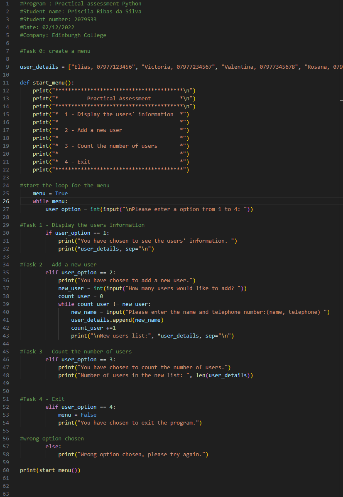

<h1><a href="https://github.com/prsilvaa"> Python User Management</a></h1>

<h2>Project Objective</h2>

Develop a user-friendly, menu-driven Python program that allows users to manage a list of contacts. The program enables displaying existing user details, adding new users with their contact information, counting the total number of users, and exiting the application safely. This project aims to practice core programming concepts such as input handling, loops, conditionals, and list operations.

<h2>Tools Used</h2>
<ul>
    <li>Python 3</li>
    <li>Console input/output</li>
    <li>Lists for data storage</li>
</ul>

<h2>Skills Gained</h2>
<ul>
    <li>Menu creation</li>
    <li>Input validation</li>
    <li>List manipulation</li>
    <li>Loop control</li>
</ul>

<h2>Outcome</h2>

Successfully created a fully functional Python program that allows users to interactively manage contact information. The application reliably handles user inputs, supports multiple additions of new users, and accurately counts and displays stored user data. It demonstrates an understanding of basic programming structures and user interface flow in a command-line environment.

    <h3>Python Code Screenshot</h3>
    
    
Screenshot of the user management Python script.

