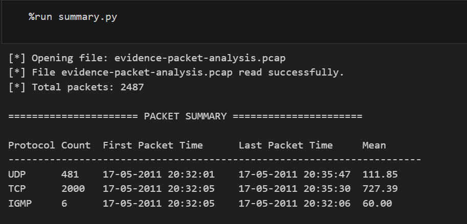
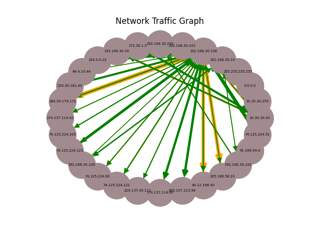
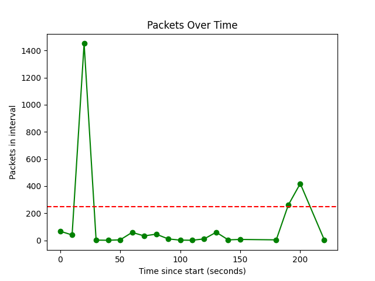

<h1>
    <a href="https://github.com/prsilvaa" target="_blank">
        Python PCAP Packet Analysis
    </a>
</h1>

<h2>Project Objective</h2>

The objective of this project was to develop a Python-based tool to analyse network packet capture (PCAP) files. The project focused on parsing packets, extracting meaningful information, visualising network communication, and identifying unusual traffic patterns using statistical analysis.

<h2>Tools Used</h2>
<ul>
    <li>Python</li>
    <li>Scapy</li>
    <li>Wireshark</li>
    <li>NetworkX</li>
    <li>Matplotlib</li>
</ul>

<h2>Skills Gained</h2>
<ul>
    <li>PCAP file parsing and analysis</li>
    <li>Network traffic inspection</li>
    <li>Python scripting and modular design</li>
    <li>Regular expressions for data extraction</li>
    <li>Graph-based network visualisation</li>
    <li>Statistical traffic analysis</li>
    <li>Exception handling and logging</li>
</ul>

<h2>Outcome</h2>

I successfully developed a Python application capable of analysing packet capture files and extracting detailed traffic statistics. The tool summarises traffic by protocol, extracts email addresses and image URLs, analyses communication between IP address pairs, and visualises network behaviour using graphs and timelines. This project strengthened my Python programming skills and enhanced my understanding of network traffic analysis and digital forensics.

    <h3>Traffic Summary Output</h3>
    
    
Summary table showing packet counts, timestamps, and mean packet sizes by protocol.

    <h3>Network Communication Graph</h3>
    
    
Directed graph visualising packet flows between IP addresses.

    <h3>Traffic Timeline Analysis</h3>
    
    
Line chart showing packet volume over time with anomaly threshold.

